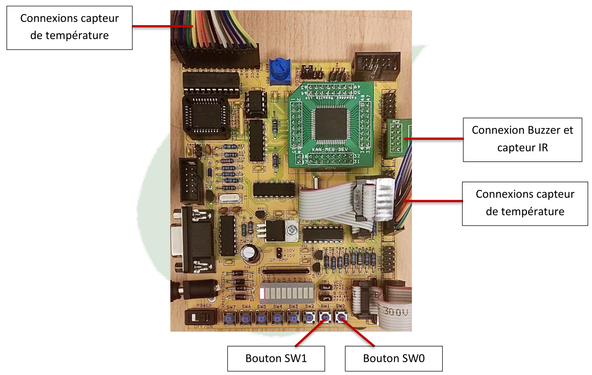
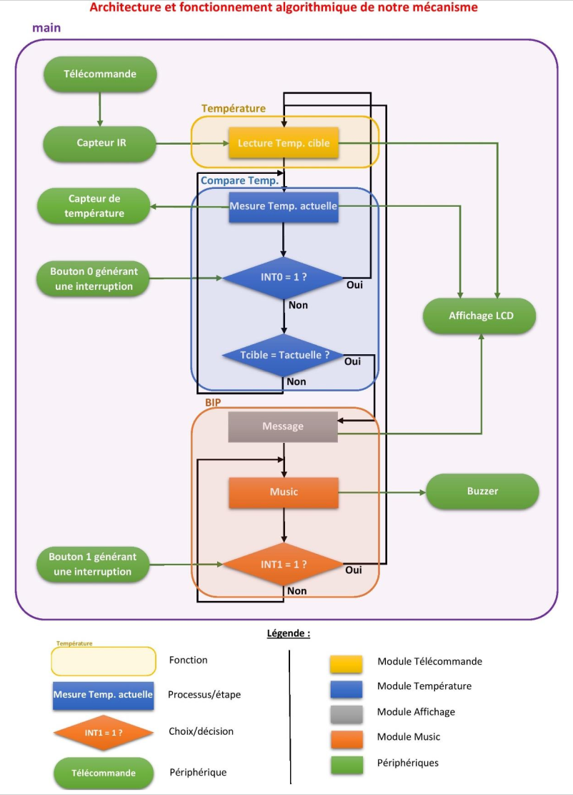

# ReadTea: Microcontroller-Based Beverage Cooling Notification System

## Project Overview

ReadTea is a microcontroller-based application designed to assist users in achieving their desired beverage temperature. The system notifies the user with an alert melody when the drink has cooled to the target temperature, enabling them to attend to other tasks without worrying about overheating or forgetting their drink.

---
## Illustrations from the Report

### 1. Hardware Overview

### 2. System Workflow Diagram

---

## Features

- **Temperature Target Input**: Users set their preferred temperature using an **IR remote control**.
- **Real-Time Display**: A 2x16 **LCD screen** displays the current beverage temperature and the target temperature.
- **Audible Notification**: A **piezoelectric buzzer** plays a melody when the target temperature is reached.
- **User Interaction**:
  - **Button SW0**: Allows users to reset or modify the target temperature.
  - **Button SW1**: Stops the notification melody when the user acknowledges it.
- **Automatic Monitoring**: Continuously compares current and target temperatures using a **1-Wire temperature sensor**.

## Technical Highlights

- **Interrupt-Driven Buttons**:
  - **INT0 (SW0)**: Enables resetting or modifying the target temperature.
  - **INT1 (SW1)**: Stops the melody and resets the system to the main menu.
- **Temperature Reading**:
  - The system uses a **1-Wire temperature sensor** to read and decode the current temperature with high precision.
- **Melody Playback**:
  - A melody is generated using a **piezoelectric buzzer**, leveraging a lookup table for musical notes.
- **LCD Display**:
  - The LCD provides user feedback, showing messages like the current temperature, target temperature, and readiness notifications.

## How It Works

1. **Initialization**:
   - The system initializes all peripherals, including the LCD, temperature sensor, and interrupts.
   - Displays the welcome message "ReadTea" on the LCD.
   
2. **User Input**:
   - The user sets the target temperature via the **IR remote control**. The system decodes the input and stores it.

3. **Temperature Monitoring**:
   - Continuously reads the current temperature and compares it to the target.
   - When the target temperature is reached, a notification melody is played.

4. **Acknowledgement**:
   - The user stops the melody by pressing **Button SW1**, resetting the system to accept a new target.

## Hardware Components

| Peripheral                       | Port   |
|----------------------------------|--------|
| IR Remote Control & Sensor       | Port E |
| LCD Display (2x16 Hitachi44780U) | Port LCD |
| 1-Wire Temperature Sensor        | Port B |
| Piezoelectric Buzzer             | Port E |
| Push Buttons (SW0, SW1)          | Port D (INT0, INT1) |
